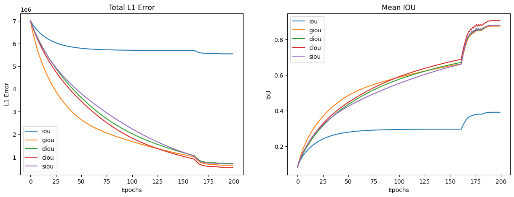

## Compare IoU losses

This repository extends experiments created by [this](https://github.com/ksachdeva/od-loss-exp/blob/main/simulation_exp.ipynb) author and includes SIoU loss which was proposed in [this](https://arxiv.org/abs/2205.12740) paper using [this](https://github.com/meituan/YOLOv6/blob/87dd3d3963b6b373ccdc626b9bae5a2afec5639e/yolov6/utils/figure_iou.py#L75) implementation.

## Results

Judge for yourself 😏

## Tags

IoU, GIoU, DIoU, CIoU, SIoU 